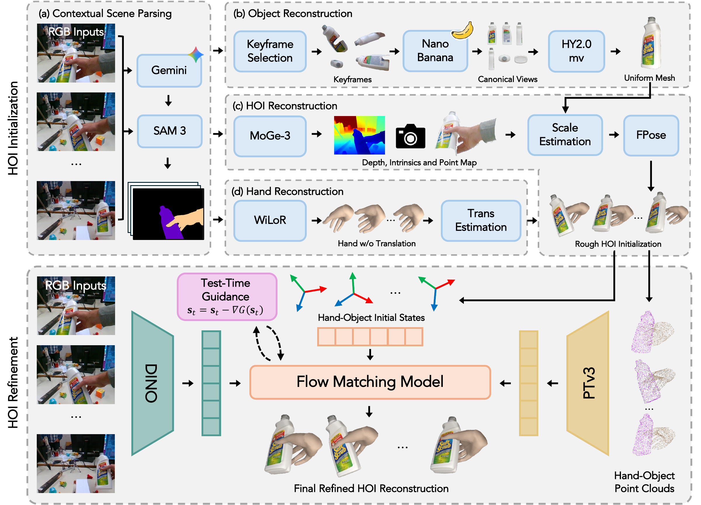

# 4D-HOF: Hand-Object Flow Matching for Feed-Forward 4D Interaction Reconstruction

<a href='https://tamu-visual-ai.github.io/4D-HOF/'></a>
<a href='https://arxiv.org/abs/2610.08782'></a>

This is the official implementation of 4D-HOF: Hand-Object Flow Matching for Feed-Forward 4D Interaction Reconstruction. 

Cleaning up for public release, stay tuned. Please see interactive examples on our [Project Page](https://tamu-visual-ai.github.io/4D-HOF/). 

## Framework
Given a monocular video, we construct initial hand-object states by leveraging foundation models, including (a) contextual scene parsing, (b) object reconstruction, (d) hand reconstruction, and (c) depth alignment for recovering metric geometry, producing coarse HOI initialization. We then formulate HOI refinement as a conditional generative bridge matching problem that takes the HOI initialization together with RGB and 3D cues as input and outputs the refined HOI reconstruction. At inference time, test-time guidance adjusts the evolving states to better satisfy physical and image-space constraints.

<p align="center">
  
</p>


## Cite
If you find our work useful, please consider citing:
```
@article{li2026_4dhof,
  title   = {4D-HOF: Hand-Object Flow Matching for Feed-Forward 4D Interaction Reconstruction},
  author  = {Li, Shiqi and Cho, Sean and Li, Yijie and Guo, Fengzhi and Wen, Bowen and Zhang, Cheng},
  journal = {arXiv preprint arXiv:2610.08782},
  year    = {2026}
}
```